# Documentation #


## Table of contents:

- [Main scripts](#main-scripts)
    + [`pre_extraction.py`](#pre_extractionpy)
        * [pre_extraction()](#pre_extraction)
        * [node_edge_filter()](#node_edge_filter)
        * [grid_filter()](#grid_filter)
        * [prod_dict()](#prod_dict)
        * [dict2graph()](#dict2graph)
        * [node_size()](#node_size)
        * [get_first_neig()](#get_first_neig)
        * [get_sec_neig()](#get_sec_neig)
        * [get_sec_neig_edges()](#get_sec_neig_edges)
        * [connecting_edges()](#connecting_edges)
        * [coloring()](#coloring)
        * [partition_set()](#partition_set)
        * [get_sec_neig_square()](#get_sec_neig_square)
        * [bar_square()](#bar_square)
        * [resizing_image()](#resizing_image)
        * [pre_extraction_from_image()](#pre_extraction_from_image)
        * [tree_approximation()](#tree_approximation)
        * [bfs_preprocess()](#bfs_preprocess)
    + [`filtration.py`](#filtrationpy)
        * [filtering()](#filtering)
        * [BP_solver()](#bp_solver)
        * [concatenate()](#concatenate)
        * [terminals_from_cont()](#terminals_from_cont)
        * [bifurcation_paths()](#bifurcation_paths)
        * [filtering_from_image()](#filtering_from_image)
        * [img_pre_extr2filtering()](#img_pre_extr2filtering)
        * [img2filtering()](#img2filtering)
- [Other scripts](#other-scripts)
    + [`continuous2graph.py`](#continuous2graphpy)
        * [preprocessing_cont()](#preprocessing_cont)
        * [graph_extraction_from_dat_files()](#graph_extraction_from_dat_files)
    + [`discrete2graph.py`](#discrete2graphpy)
        * [graph_filtering_from_dat_files()](#graph_filtering_from_dat_files)
    + [`source_sink_generator.py`](#source_sink_generatorpy)
        * [bar2dict()](#bar2dict)
        * [fsource()](#fsource)
        * [fsink()](#fsink)

- [How to run the complete procedure?](#how-to-run-the-complete-procedure)
- [Examples](#examples)

## Main scripts

The 3-step network extraction process can be divided into 2 main python scripts:

- `pre_extraction.py`
- `filtration.py`

Each one of them controls one of the main steps described in the _paper_. We give here a detailed explanation about how to use them, together with some examples. 

___

### `pre_extraction.py`:

___

This script contains the following functions: `prod_dict`, `dict2graph`, `node_size`,  `get_first_neig`,  `get_sec_neig`,  `get_sec_neig_edges`, `connecting_edges`,  **`grid_filter`**,  **`node_edge_filter`**,  **`pre_extraction`**, `coloring`, `partition_set`, `get_sec_neig_square`, `bar_square`, `resizing_image`, `pre_extraction_from_image`, `tree_approximation`, `bfs_preprocess`.

The most relevant functions in this script are: **`grid_filter`**,  **`node_edge_filter`** and  **`pre_extraction`**.

Schematically, the script works like this


```
                     pre_extraction()
                            |
                            |
                        (graph_type?)
                            |
                            |
                    ------------------
                    |                |
                    |                |
                  (1,2)             (3)
                    |                |
                    |                |
            node_edge_filter()    grid_filter()
                    |                |
                    |                |
                    ------------------
                            |
                            |
                    [G_pre-extraction]

```

___

#### pre_extraction()

*This function extracts a graph from a weighted partition of the set [0,1]^2.*

+ **inputs**:
    - *G_bar* : a weighted networkX graph whose nodes are the barycenters of the elements of the grid.
    - *G_triang* : the grid graph.
    - *dict_seq* : dictionary mapping grid elements into their vertices. Namely, dict_seq for the key-th element of the
        grid with vertices are n1,n2 and n3 needs to be defined as *dict_seq*[key]=[n1,n2,n3].  It works with triangular and squared grids.
    - *graph_type* : 1 (to use edges and vertices of the grid), 2 (to use only edges), 3 (to use elements of the grid).
    - *min_* : threshold for the weights of the edges after pre-extraction.
    - *max_* : maximum weight of nodes in G_bar. 
    - *weighting_method* : 'ER', 'AVG'.

+ **return** 
    - *G_filtered* : pre-extracted graph.


___

#### node_edge_filter()

*This script adds edges between tringles (as in 1 and 2) if the weight of the corresponding barycenters are greater than the threshold (min_) x max_.*

+ **inputs**:
    - *G_bar* : a weighted networkX graph whose nodes are the barycenters of the elements of the grid. No edges.
    - *min_* :  threshold for the weights of the edges after pre-extraction.
    - *graph_type* : 1 (to use edges and vertices of the grid), 2 (to use only edges), 3 (to use elements of the grid).
    - *dict_seq* :  dictionary mapping grid elements into their vertices. Namely, dict_seq for the key-th element of the
    grid with vertices are n1,n2 and n3 needs to be defined as dict_seq[key]=[n1,n2,n3].  It works with triangular and squared grids.
    - *max_* : maximum weight of nodes in X_bar.
    - *weighting_method* : 'ER', 'AVG'.
    - *input_flag* : 'image' or None (for dat files)
    - *node2box_index* : given a node, node2box_index[node] returns the indices of all the elements of the partition s.t.,
    node is a vertex of these elements
+ **return** 
    - *G_bar* : the input graph but with edges generated according to graph_type.

___

#### grid_filter()

*This script adds the edges of a triangle (as in 3) if the weight of its barycenter is greater than the threshold (min_) x max_.*

+ **inputs**:
    - *G_bar* : a weighted networkX graph whose nodes are the barycenters of the elements of the grid. No edges.
    - *G_triang* : the grid graph.
    - *min_* : threshold for the weights of the edges after pre-extraction.
    - *dict_seq* : dictionary mapping grid elements into their vertices. Namely, dict_seq for the key-th element of the
    grid with vertices are n1,n2 and n3 needs to be defined as dict_seq[key]=[n1,n2,n3].  It works with triangular and squared grids.
    - *max_* : maximum weight of nodes in G_bar.
+ **return** 
     - *G_filtered* : the input graph but with edges generated according to graph_type 3.
    
___

#### prod_dict()
    
*Key-wise multiplication of two dictionaries. Component-wise multiplication of two lists.*

+ **inputs**:

    - *File1* :  dictionary.
    - *File2* : dictionary.
    - *weights1* : list.
    - *weights2* : list.

+ **return**: 
    
    - *newDict* : dictionary with same keys as File1 (or File2) but values equal to the multiplication of File1 and File2.
    - *newWeights* : list whose entries are the multiplication of weights1 and weights2.
    
___

#### dict2graph()
    
*Graph generator from two dictionaries.* 

+ **inputs**:

    - *bar_pos* : dictionary, s.t., dictionary[key]= position of key in domain.
    - *dict_weights_func* : dictionary, s.t., dictionary[key]= weight of key.

+ **return**:

    - *X_func* : weighted graph whose nodes have two attributes: 'pos' and 'weight'.
    - *pos* : nx.get_node_attributes(X_func, "pos"). 

___

#### node_size()
    
*Defining the size of the nodes. This gives the size to the nodes depending on the weight of each one of them. Plot related.*

+ **inputs**:

    - *dict_weights_func* : dictionary, s.t., dictionary[key]= weight of key.

+ **return**:

    - *size_func* : list whose entries are the sizes for the nodes.
 
___   

#### get_first_neig()
    
*This returns the vertices that belong to the triangle for which 'node' is the barycenter.*

+ **inputs**:

    - *node* : node in G_bar.
    - *dict_seq* :  dictionary mapping grid elements into their vertices. Namely, dict_seq for the key-th element of the
    grid with vertices are n1,n2 and n3 needs to be defined as dict_seq[key]=[n1,n2,n3].  It works with triangular and squared grids.

+ **return**:

    - *same_triang* : all the nodes in the triangle (or element of the grid) s.t., node is its barycenter.

___

#### get_sec_neig()
    
*This returns all the triangles that share either a vertex or an edge with the triangle in which the 'node' is the barycenter.*

+ **inputs**:
    - *node* : target node.
    - *dict_seq* : dictionary mapping grid elements into their vertices. Namely, dict_seq for the key-th element of the
grid with vertices are n1,n2 and n3 needs to be defined as dict_seq[key]=[n1,n2,n3].  It works with triangular
and squared grids.
+ **return**:
    - *dict_sec_neig* : dictionary, s.t., dict_sec_neig[node]= indexes of all the surrounding triangles of 'node'.
    - *index_* : **check this output. it seems to be removable.**

___


___
#### get_sec_neig_edges() 
    
*This returns all the triangles that share an edge with the triangle in which the 'node' is the barycenter.*

+ **inputs**:

    - *node* : target node.
    - *dict_seq* : dictionary mapping grid elements into their vertices. Namely, dict_seq for the key-th element of the
        grid with vertices are n1,n2 and n3 needs to be defined as dict_seq[key]=[n1,n2,n3].  It works with triangular
        and squared grids.

+ **return**:

    - *dict_sec_neig* : dictionary, s.t., dict_sec_neig[node]= indexes of all the surrounding triangles of 'node'.
    - *index_* : **check this output. it seems to be removable.**

___

#### connecting_edges()

    
*Testing the condition of the tdens for a single barycenter . If condition is satisfied, add the edge with weight. In-place modification of G_bar.*

+ **inputs**:
    - *G_bar* : a weighted networkX graph whose nodes are the barycenters of the elements of the grid. No edges.
    - *node* : target node.
    - *min_* : threshold for the weights of the edges after pre-extraction.
    - *graph_type* : 1 (to use edges and vertices of the grid), 2 (to use only edges), 3 (to use elements of the grid).
    - *dict_seq* : dictionary mapping grid elements into their vertices. Namely, dict_seq for the key-th element of the
        grid with vertices are n1,n2 and n3 needs to be defined as dict_seq[key]=[n1,n2,n3].  It works with triangular and squared grids.
    - *max_* : maximum weight of nodes in G_bar.
    - *weighting_method* : 'ER', 'AVG'.
    - *input_flag* : 'image' or None (for dat files)
    - *node2box_index* :  given a node, node2box_index[node] returns the indices of all the elements of the partition s.t.,
    node is a vertex of these elements

+ **return**:

___


#### coloring()
*This functions assigns a "color" (an integer between 0 and N-1) to a pixel.*

+ **inputs**:

    - *pixel_val* : normalized real value of the pixel.
    - *N* : number of colors.

+ **return**:

    - *color* : integer \in \{0,1,...,N-1\}.

___

#### partition_set()
*Generates a regular partition of the set [0,1]^2.*

+ **inputs**:

    - *N* : number of divisions of the interval [0,1] (endpoints count as divisions).

+ **return**:

    - *part_dict* : dictionary, s.t., part_dict[key]=[(x1,y1),...,(x4,y4)].
    - *dict_seq* : dictionary mapping grid elements into their vertices. Namely, dict_seq for the key-th element of the
    grid with vertices are n1,n2,n3 and n4 needs to be defined as dict_seq[key]=[n1,n2,n3,n4].
    - *node2box_index* :  given a node, node2box_index[node] returns the indices of all the elements of the partition s.t.,
    node is a vertex of these elements.

___

#### get_sec_neig_square()
    
*This returns all the squares that share either a vertex or an edge with the square in which the 'node' is the barycenter.*

+ **inputs**:

    - *node* : target node.
    - *dict_seq* : dictionary mapping grid elements into their vertices. Namely, dict_seq for the key-th element of the grid with vertices are n1,n2 and n3 needs to be defined as dict_seq[key]=[n1,n2,n3].  It works with triangular and squared grids.

+ **return**:

    - *dict_sec_neig* : dictionary, s.t., dict_sec_neig[node]= indexes of all the surrounding triangles of 'node'.
    - *index_* : **check this output. it seems to be removable.**

___

#### bar_square()

*This returns the coordinates of the barycenter of a square defined by coord.*

+ **inputs**:

    - *coord* : list of coordinates of square (len(4)).

+ **return**:

    - *x_bar* : x-coordinate of barycenter.
    - *y_bar* : y-coordinate of barycenter.
    
___

#### resizing_image()

*This resizes and repaints an image.*

+ **inputs**:

    - *image_path* : string.
    - *number_of_colors* : number of colors for the output image.
    - *t* : noise threshold. If t=0, then all the new pixels are preserved with their new colors.

+ **return**:

    - *width* : width of the output image.
    - *color_dict* : dictionary s.t., color_dict[key]= real value for the key-th pixel. key is the index for the pixels in the resized image.
    - *saving_path* : string, to where the new image is saved.
    
___

#### pre_extraction_from_image()
    
*This takes an image and return a graph extracted from it according to the pre-extraction rules.*

+ **inputs**

    - *image_path* : string.
    - *graph_type* : 1 (to use edges and vertices of the grid), 2 (to use only edges).
    - *t1* : noise threshold. If t=0, then all the new pixels are preserved with their new colors.
    - *t2* : threshold for the weights of the edges after pre-extraction.
    - *number_of_colors* : number of colors for the output image.
    - *number_of_cc* : number of connected components of the graph represented by the image. If None, then only 1
    cc is assumed.

+ **return**

    - *small_G_filtered* : pre-extracted graph.

___

#### tree_approximation()

*This returns a tree approximation of the input graph. In this case, the graph used is the bfs rooted at the lowest labeled node.*

+ **inputs**:

    - *Graph* :  a networkx graph.

+ **return**:

    - *bfs_Graph* : bfs approximation of G.
    
___

#### bfs_preprocess()

*This is the combination of pre_extraction_from_image and tree_approximation.*

+ **inputs**:

    - *image_path* : string.
    - *number_of_colors* : number of colors for the output image.
    - *t1* : noise threshold. If t=0, then all the new pixels are preserved with their new colors.
    - *t2* : threshold for the weights of the edges after pre-extraction.
    - *number_of_cc* : number of connected components of the graph represented by the image. If None, then only 1
    cc is assumed.
    - *graph_type* : 1 (to use edges and vertices of the grid), 2 (to use only edges).

+ **return**:

    - *bfs_Graph* : bfs approximation of G.
    


___

### `filtration.py`:

___

This script contains the following functions: `concatenate`, `terminals_from_cont`, `terminals_from_image`, `bifurcation_paths`, **`BP_solver`**,`filtering_from_image`, `img_pre_extr2filtering`, **`filtering`**, `img2filtering`.

The most relevant functions in this script are: **`BP_solver`** and **`filtering`**.

Schematically, the script works like this

```
                        filtering()   
                            |                   
                            |
                      pickle2pygraph()
                            |
                            |
                       (DMK or image?)
                            |
                            |
                     ----------------
                     |              |
                     |              |
         terminal_from_cont()    (terminals given)   
                     |              |
                     |              |
                     ----------------
                            |
                            |
                        dat2pygraph()
                            |
                            |
                (number of connected components?)
                            |
                            |
        ----------------------------------------------
        |             |            | ... |           |
    component 1   component 2        ...         component N
        |              |           |     |           |
        |              |           |     |           |
    graph2inc..()   graph2inc..()    ...         graph2inc..()
        |              |           |     |           |
        |              |           |     |           |
    BP_solver()    BP_solver()       ...         BP_solver()
        |              |           |     |           |
        |              |           |     |           |
    filtered g.1   filtered g.2      ...         filtered g.N
        |              |           |     |           |
        |              |           |     |           |
        ----------------------------------------------
                           |
                           |
                    union of filtered g.
                           |
                           |
                     (reweighting?) 
                           |
                           |
                     [G_filtration]   

```
___

#### filtering()

*This function takes a pre-extracted graph and filters it applying the DMK discrete dynamics.*

+ **inputs**:
    - *Graph*: a networkx graph to be filtered.
    - *folder_name*: folder path where the outputs will be stored. It should be written "./runs/folder_name".
    - *graph_type*: 1 (to use edges and vertices of the grid), 2 (to use only edges), 3 (to use elements of the grid)
    - *weighting_method_simplification*: 'ER', 'IBP', 'BPW'.
    - *weight_flag*: 'length', to use the length of the edges; else, to use unit length edges.
    - *min_*: threshold for the weights of the edges after filtering.
    - *BP_weights*: 'BPtdens' to use optimal transport density as weights for edges, 'BPflux' to use optimal flux.
    - *terminal_info*:  
        + for dat files (i.e. *from continuous*): [
        source_flag,
          sink_flag,
          btns_factor_source,
        btns_factor_sink].
        + for *images*:
        terminal_info = [
        terminals,
        entry]
    - *input_flag*: 'image' or None (for dat files)
+ **return**:
    - *G_final_simplification*: filtered graph (networkx graph).
    - *newGraph*: dictionary, s.t., newGraph[i]= i-th cc (labeled from 0 to len(cc)-1).
    - _ncc_: number of connected components of Graph.
    - *possible_terminals_source*: for each i, possible_terminals_source[i]= "sources" of i-th cc.
    - *possible_terminals_sink*: for each i, possible_terminals_sink[i]= "sinks" of i-th cc.
    - *mapping*: for each i, mapping[i]: labels of i-th cc -------------> labels of Graph.

___

#### BP_solver()

*This script executes the BP_solver (a muffe_sparse_opt/dmk_folder.py sequence)*

+ **inputs**:

    - *folder_name* : folder path where the outputs will be stored. It should be written "./runs/folder_name".
    - *index* : integer representing the connected component to which this algorithm is going to be applied.

+ **return**:

___

#### concatenate()
    
*This concatenates all the lists contained in a list.*

+ **inputs**:

    - *lists* : a list of lists.

+ **return**:

    - *new_list* : concatenated list. 

___

#### terminals_from_cont()
    
*Computation of source and sink nodes. This script uses information about the inputs of the DMK solver. There are three criteria for the selection of the nodes.* 

+ **inputs**:

    - *Graph* : a networkx graph to be filtered.
    - *source_flag* : flag used to define the source region in the continuous problem.
    - *sink_flag* : flag used to define the sink region in the continuous problem.
    - *btns_factor_source* : threshold for the nodes in the source region (see more in paper).
    - *btns_factor_sink* : threshold for the nodes in the sink region (see more in paper).
    - *terminal_criterion* : 'branch_convex_hull+btns_centr' (combination of btns centr and convex hull by branches),
    'whole_convex_hull+btns_centr' (combination of btns centr and convex hull of the source and sink regions),
    'btns_centr' (only btns centr).

+ **return**:

    - *possible_terminals_source* : for each i, possible_terminals_source[i]= "sources" of i-th cc.
    - *possible_terminals_sink* : for each i, possible_terminals_sink[i]= "sources" of i-th cc.

___

#### bifurcation_paths()
    
*This script takes a filtered graph and reduces its paths (sequences of nodes with degree 2) to a single edge.*

+ **inputs**:

    - *G* :  filtered graph (networkx graph).
    - *terminals* : union of source and sink nodes.

+ **return**:

    - *G* : reduced graph.

___

#### filtering_from_image()
    
*This takes as input a pre-extracted graph (obtained from an image) and filters it using filtering().*

+ **inputs**:

    - *small_G_filtered* : pre-extracted graph.
    - *terminals* : union of source and sink nodes.
    - *color_dict* : dictionary s.t., color_dict[key]= real value for the key-th pixel.
    key is the index for the pixels in the resized image.
    - *partition_dict* : dictionary, s.t., part_dict[key]=[(x1,y1),...,(x4,y4)].
    - *weighting_method_simplification* : 'ER', 'IBP', 'BPW'.
    - *entry* : node index. terminals[entry] is the unique source node.
    - *folder_name* : folder path where the outputs will be stored. It should be written "./runs/folder_name".

+ **return**:

    - *G_final_simplification* : filtered graph (networkx graph).
 
___   

#### img_pre_extr2filtering()
    
*This takes as input a path containing the bfs approximation of the pre-extracted graph. This pre-extracted graph has been obtained from an image. The output is the filtered graph.*

+ **inputs**:

    - *image_path* : string.
    - *filter_size* : radious of the filters for the terminal selection process.
    - *weighting_method_simplification* : 'ER', 'IBP', 'BPW'.

+ **return**:

    - *G_final_simplification* : filtered graph (networkx graph).

___

#### img2filtering()
    
*This takes as input an image and outputs the filtered graph.*

+ **inputs**:

    - *image_path* : string.
    - *number_of_colors* : number of colors for the output image.
    - *t1* : noise threshold. If t=0, then all the new pixels are preserved with their new colors.
    - *t2* : threshold for the weights of the edges after pre-extraction.
    - *number_of_cc* : number of connected components of the graph represented by the image. If None, then only 1
    cc is assumed.
    - *graph_type* : 1 (to use edges and vertices of the grid), 2 (to use only edges).

+ **return**:

    - *G_final_simplification* : filtered graph (networkx graph).


## Other scripts

### `continuous2graph.py`

___

#### preprocessing_cont()  

*Prepocessing the data obtained by the DMK solver to be used as inputs in the pre-extraction step.*

+ **inputs**:

    - *folder_name* : folder path where the outputs will be stored. It should be written "./runs/folder_name".
    - *min_* : threshold for the weights of the edges after filtering.
    - *funct* : weights to be assigned to the edges. Either 'tdens' or 'flux'.

+ **return**:

    - *G_bar* : a weighted networkX graph whose nodes are the barycenters of the elements of the grid. No edges.
    - *G_triang* : the grid graph. 
    - *dict_seq* : dictionary mapping grid elements into their vertices. Namely, dict_seq for the key-th element of the
    grid with vertices are n1,n2 and n3 needs to be defined as dict_seq[key]=[n1,n2,n3].  It works with triangular 
    and squared grids.
    - *max_* : maximum weight of nodes in G_bar.

___

#### graph_extraction_from_dat_files()


*From DMK outputs to pre-extraction step.*

+ **inputs**:

    - *folder_path* : folder path where the outputs will be stored. It should be written "./runs/folder_name".
    - *min_* : threshold for the weights of the edges after pre-extraction.
    - *graph_type* : 1 (to use edges and vertices of the grid), 2 (to use only edges), 3 (to use elements of the grid).
    - *funct* : weights to be assigned to the edges. Either 'tdens' or 'flux'.
    - *weighting_method* : 'ER', 'AVG'.
    - *source_flag* : flag used to define the source region in the continuous problem.
    - *sink_flag* : flag used to define the sink region in the continuous problem.

+ **return**:

    - *Graph* : pre-extracted graph.

___

### `discrete2graph.py`

___

#### graph_filtering_from_dat_files()

*This script computes the filtering of a Graph pre-extracted from the outputs of the DMK solver.*

+ **inputs**:

    - *folder_name* :folder path where the outputs will be stored. It should be written "./runs/folder_name".
    - *t* :threshold for the weights of the edges after filtering.
    - *graph_type* :1 (to use edges and vertices of the grid), 2 (to use only edges), 3 (to use elements
    of the grid).
    - *funct* :weights to be assigned to the edges. Either 'tdens' or 'flux'.
    - *min_* :threshold for the weights of the edges after pre-extraction.
    - *btns_factor_source* :threshold for the nodes in the source region (see more in paper).
    - *btns_factor_sink* :threshold for the nodes in the sink region (see more in paper).
    - *weighting_method* :'ER', 'AVG'.
    - *weighting_method_simplification* :'ER', 'IBP', 'BPW'.
    - *source_flag* :flag used to define the source region in the continuous problem.
    - *sink_flag* :flag used to define the sink region in the continuous problem.
    - *BP_weights* :'BPtdens' to use optimal transport density as weights for edges, 'BPflux' to use optimal flux.
    - *reduction_flag* :If 'yes', then the filtered graph is reduced using *bifurcation_paths()*.

+ **return**:

    - *G_final_simplification* :filtered graph (networkx graph).

___

### `source_sink_generator.py`:

___

#### bar2dict():

*From coordinates list to dictionary.*

+ **inputs**:
    
    - *graph_coordinates* : list containing coordinates of barycenters.

+ **return**:

    - *bar_pos* : dictionary, s.t., bar_pos[key]=(x,y) where key is the label for the key-th node and (x,y) is its location.

___

#### fsource():

*Source selection based on coordinates of a node. If f is the source/sink function and z=f(x,y)!=0, then (x,y) is source.*

+ **inputs**:

    - *x* : x coordinate.
    - *y* : y coordinate.
    - *flag* : string for source:   '2rcs',
                                    '2rcl',
                                    '3rc',
                                    '3rch',
                                    '3rcl',
                                    '5rch',
                                    '5rcm',
                                    '5rcl',
                                    '4rch',
                                    '4rcl',
                                    '4rcm',
                                    '6rcl' ...


+ **return**:

    - *z* : source value.

To understand the meaning of the different flags, please check the plot below.
___

#### fsink()

*Sink selection based on coordinates of a node. If f is the source/sink function and z=f(x,y)!=0, then (x,y) is sink.*

+ **inputs**:

    - *x*: x coordinate.
    - *y*: y coordinate.
    - *flag*: string for source:    '2rcs',
                                    '2rcl',
                                    '3rc',
                                    '3rch',
                                    '3rcl',
                                    '5rch',
                                    '5rcm',
                                    '5rcl',
                                    '4rch',
                                    '4rcl',
                                    '4rcm',
                                    '6rcl' ...


+ **return**:

    - *z*: sink value.

To understand the meaning of the different flags, please check the plot below.
___

We show the different configurations used for source and sink generation. They can be used by typing the corresponding flags as a parameter of the fuctions *fsource* and *fsink*. 

<p align="center">
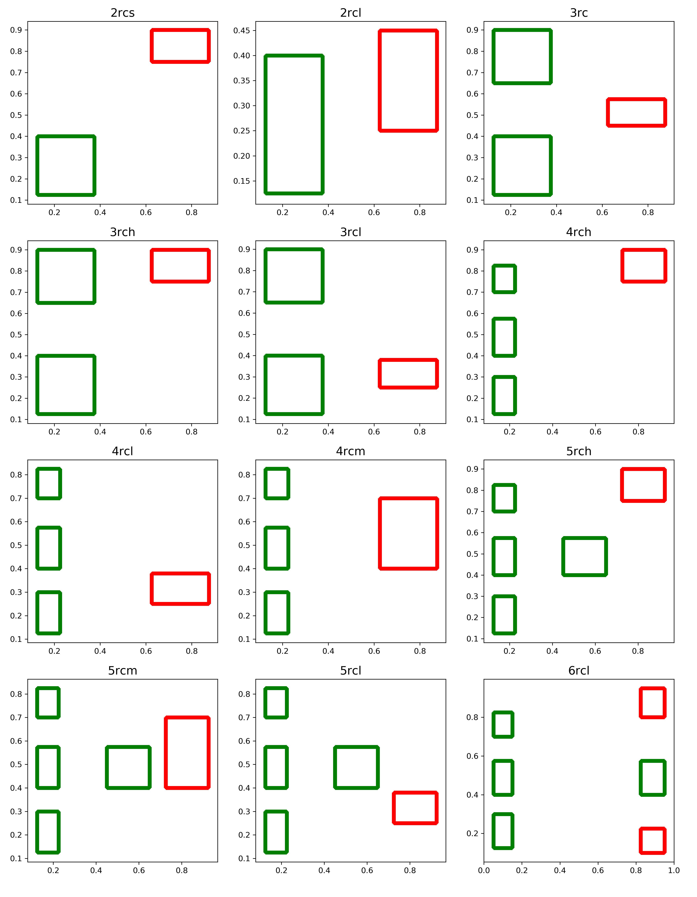
</p>


## How to run the complete procedure? ##


### `network_extraction.py`:

To execute the complete routine it is necessary to run the python script `network_extraction.py`. This script combines the three well-described steps to output a graph coming from a solution of a transportation problem. 

All this is done through the function *network_extraction().*

___ 

#### network_extraction()

*This script runs the network extraction procedure: DMK-solver, graph pre-extraction and graph-filtering. Input values must be given as "flag1,flag2,flag3,..." if many flags are used.*

+ **inputs**:

    - *flag_list* : flags used for the initial transport density.
    - *beta_list* : values for exponent beta of DMK-solver (1st step).
    - *ndiv_list* : number of divisions of the x-axis used to the creation of the mesh.
    - *source_list* : flags for source function.
    - *sink_list* : flags for sink function. If "=", then it takes the same value as source_list.
    - *bd_list* : values for exponent beta of filtering (3rd step).
    - *dmk_input* : "yes" if DMK-solver to be used.
    - *ge_input* : "yes" if graph pre-extraction to be done.
    - *gs_input* : "yes,yes" if graph filtering *and* graph reduction to be done.


+ **return**:

    - outputs stored in *./runs/folder_name*.

___

An example of an execution of `network_extraction.py` looks like this:


 <p align="center">
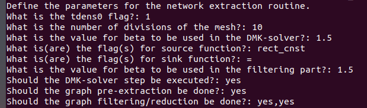
</p>


Once all the inputs are provided, the network extractions starts. It will go through the different parts depending on the given parameters. If the user wants to execute *just* one of the 3 steps, then she/he has to type *no*, as answer for the questions related to the other steps. 

All the outputs will be stored in mentioned location, and a control file will be placed inside such folder. This file contains the information about the used parameters.  
___

## Examples ##

*The images shown here can be obtained from the PlotlyVisualizationTools (1-10) jupyter notebooks. It shows the graphs and the different structures mentioned here in a very interactive way (thanks to the Plotly tools). The data used to run the notebooks can be found in the folder PVM_data.*

In the next cells we show the steps followed by the scripts to extract graphs from: solutions given by the DMK solver and real images. 

___


#### PMV 1: Grid built for a transportation problem.

The grid for one transportation problem could look like this:

 <p align="center">
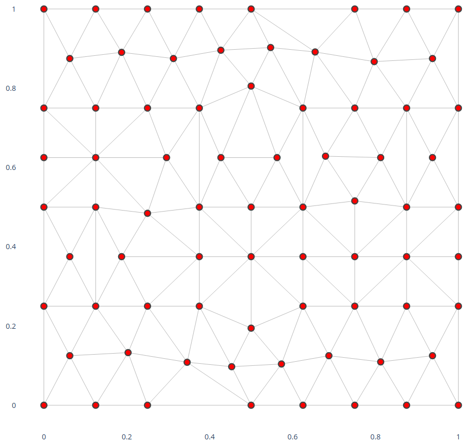
</p>

On top of the grid we can place two different sets to be used as target in the transportation problem. They are named the *source* (green rectangle) and the *sink* (red rectangle). Once this is defined, and the other parameters are chosen, the *DMK solver* is executed and a solution is found. This solution might represent the *optimal set of transport density* or the *optimal set of fluxes*, needed them to transport "goods" from the source to the sink. In the following image, we show all the barycenters for the different triangles of the grid. Their color represents their *weight* (i.e., the *optimal value*associated to the triangle where they are taken from). 

 <p align="center">
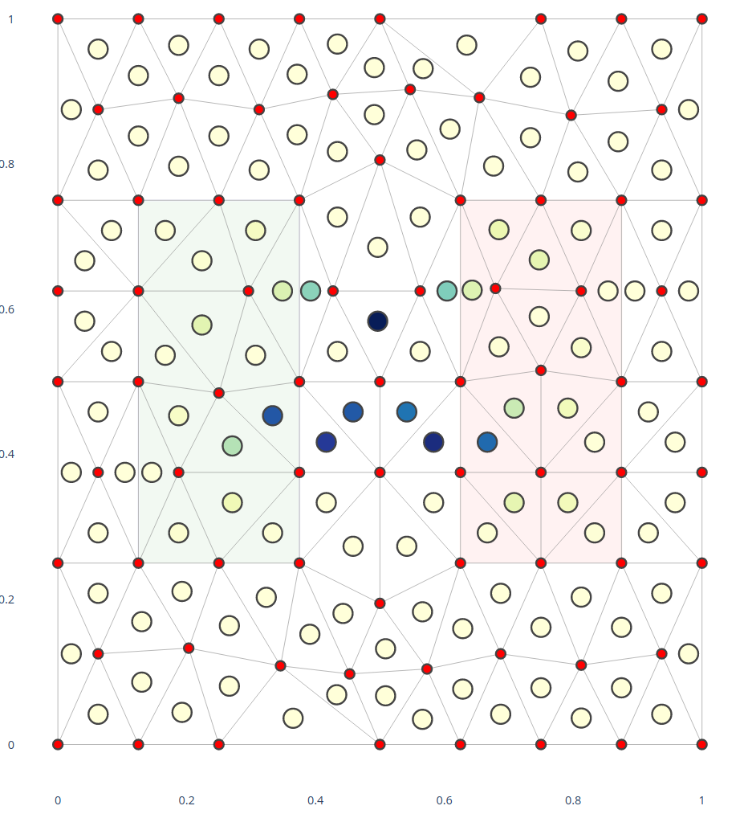
</p>

___

#### PMV 2: Neighbors of a triangle. 

An important part of the graph extractiong relies on the knowledge about the neighbors of a particular barycenter. The way we do this is by using the functions *get_first_neig()* and *get_second_neig()*. When a node is given, it outputs the labels of the nodes that are *close* to it.  The following lines of code give the neighbors (orange nodes) of the chosen node '30' (yellow label). 

```
from pre_extraction import get_first_neig, get_sec_neig

Node_='30'

nodes = get_first_neig(Node_, dict_seq)

dict_sec_neig, index_ = get_sec_neig(Node_, dict_seq)

```

The result can be seen in the next figure.

<p align="center">

</p>


___

#### PMV 3: Pre-extracted graph. 


From the *optimal* values shown before, it is posible to obtain the pre-extracted graph $G$ representing that solution. For instance, to get a graph using method "1", we need to run the following piece of code:


```
min_=.1
graph_type='1'
weighting_method='ER'

G = node_edge_filter(G_bar,
                 min_,
                 graph_type,
                 dict_seq,
                 max_,
                 weighting_method)

```

The computed graph looks like this:

<p align="center">
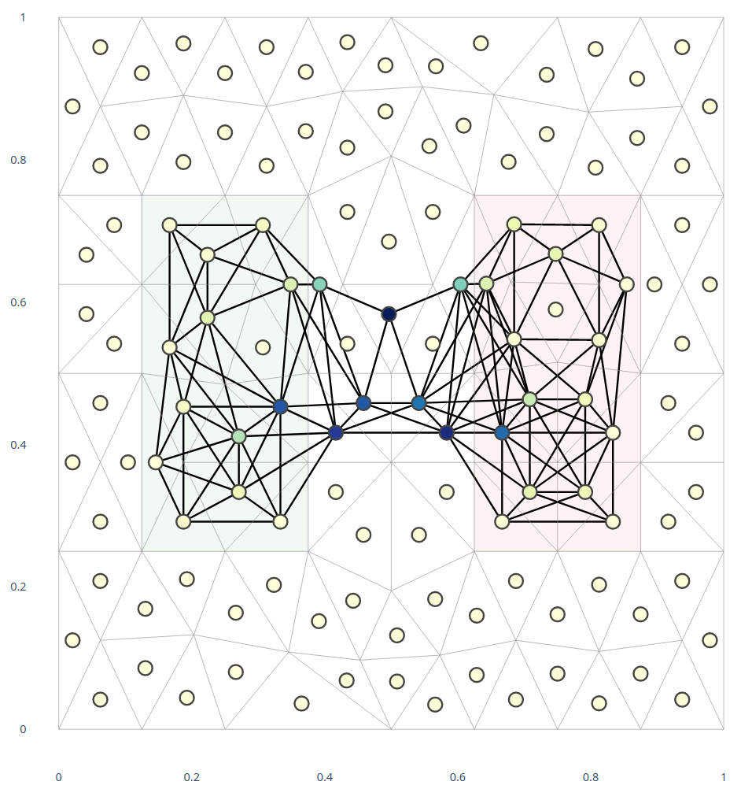
</p>

___

#### PMV 4: Terminals from the continuous problem


Once a graph is pre-extracted, it is still possible to go further and filter some of its parts out. Usually the pre-extracted graphs contain some redundant information, undesirable for some applications. Cleaner versions of it can be obtained by using the function *filtering()*.  This function converts the graph $G$ into a dynamical system (that can be thought as a flow problem) in which some stationary edges can be found, ruling out the non essential parts. In few words, this steps is based in an application of a transportation problem but this time defined on the graph $G$. In order to be able to *transport* goods in the graph it is mandatory to say where the injection and extraction of these goods is done. Therefore, to do this we need to compute new sets of *sources* and *sinks*. The function *terminals_from_cont()* takes care of this task. It gets special nodes from the previously defined source and sink sets used in the continuous case. 


```
source_flag='rect_cnst'
sink_flag ='rect_cnst'
btns_factor_source=.1
btns_factor_sink=.1

possible_terminals_source, possible_terminals_sink = terminals_from_cont(Graph, 
                    source_flag, sink_flag, 
                    btns_factor_source, btns_factor_sink, 
                    terminal_criterion='branch_convex_hull+btns_centr')

```

Recall that the previously defined source and sink regions look like this:

<p align="center">
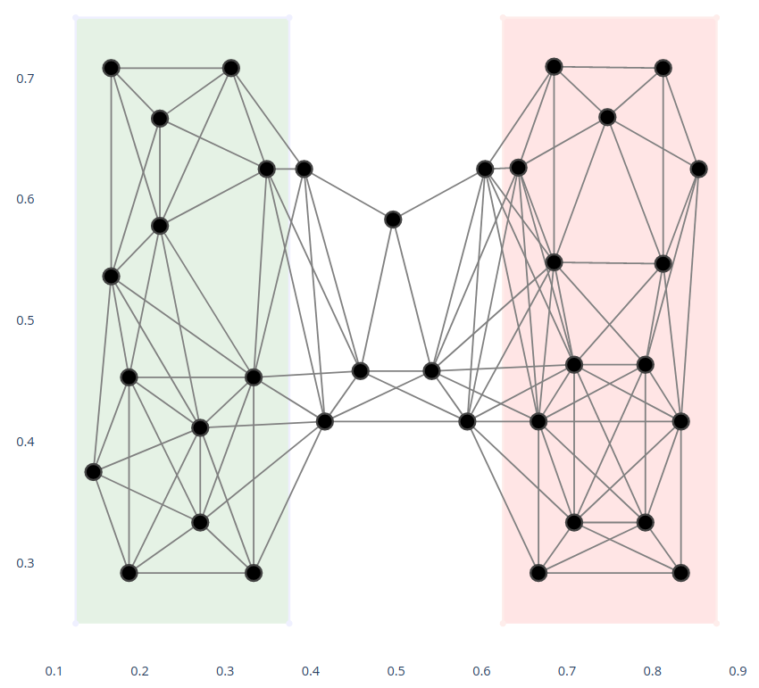
</p>


The highlited nodes correspond to the outputs of the function *terminals_from_cont()* (again, green for the source and red for the sink):

<p align="center">
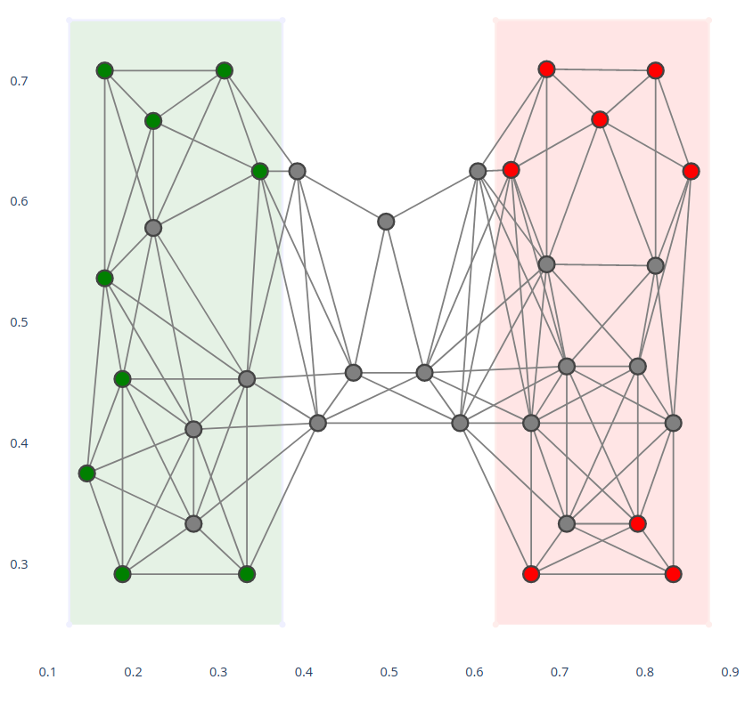
</p>

___

#### PMV 5: Filtering

Once the terminals are found, we can filter the graph $G$ by executing the following lines of code:

```
from filtering import filtering 

folder_name='./runs/1_b14_6dv_sf14_rect_cnstrect_cnst/'
graph_type="1"
weighting_method_simplification='ER'
weight_flag=None
min_=0.0001
BP_weights='BPtdens'
beta_d=1.5
terminal_info=[source_flag,sink_flag,btns_factor_source,btns_factor_sink] 

G_filtered, _, _, _, _, _ = filtering(G,
              folder_name,
                beta_d,
              graph_type,
              weighting_method_simplification,
              weight_flag,
              min_,
              BP_weights,
              terminal_info,
              input_flag = 'image')


```

The filtered version of $G$ is shown in the following figure (blue edges):

<p align="center">
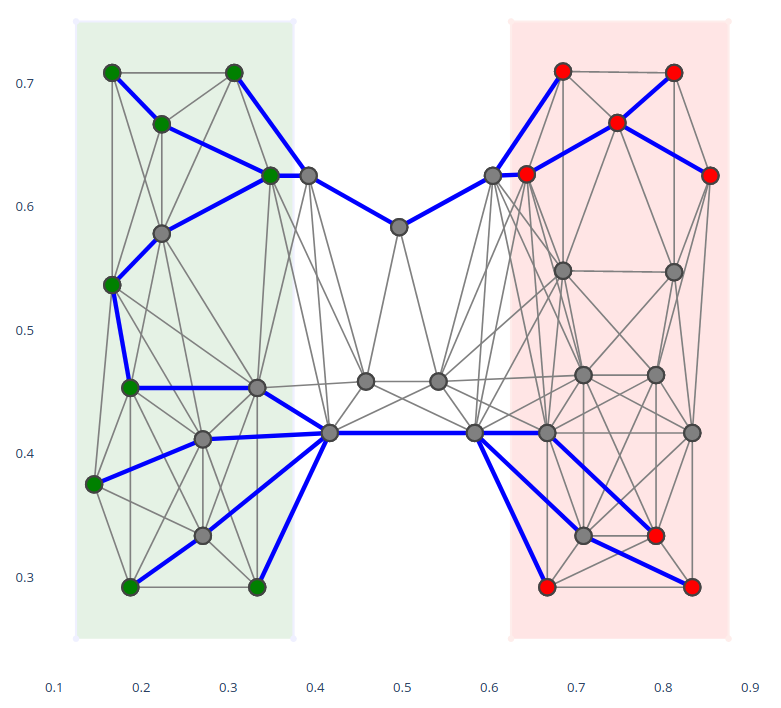
</p>

___

#### PMV 6: Reduced graph

For some particular application it might be useful to remove all of those nodes in $G$ that have degree two. The function *bifurcation_paths()* reduces the graph $G$ to a new graph that removes these degree-2 nodes and joins the broken parts with new edges. At the end, the nodes that survive are the those representing either sources or sinks, bifurcation points or endpoints. 

```

from filtering import bifurcation_paths

source_nodes_in_1_cc = list(possible_terminals_source[1])
sink_nodes_in_1_cc = list(possible_terminals_sink[1])

terminals=list(set(source_nodes_in_1_cc+sink_nodes_in_1_cc))

G_reduced = bifurcation_paths(G_final_simplification, terminals)
```


The resulting graph is shown in the following figure. It has yellow edges. As you can see, a path made of nodes with degree two was removed (blue one). 

<p align="center">
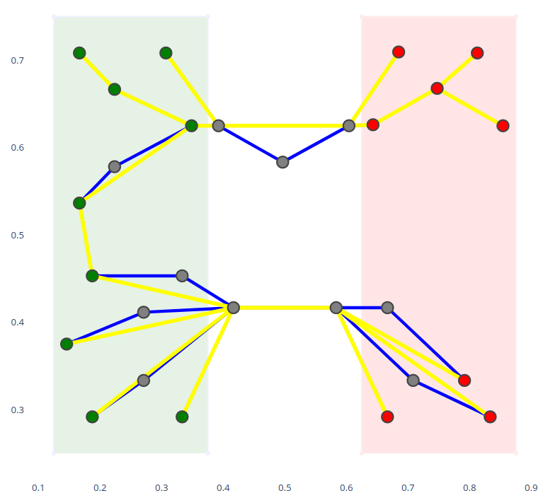
</p>

___

#### PMV 7: Graph pre-extraction from image

Graphs can be also obtained from images and not only from solution of transportation images. Sometimes, images show network structures embedded on them and having a tool to get them might result useful.

In this and the following 3 modules we show how to get them using the same functions mentioned in the previous modules. 

Image you have an image that looks like this: 

<p align="center">
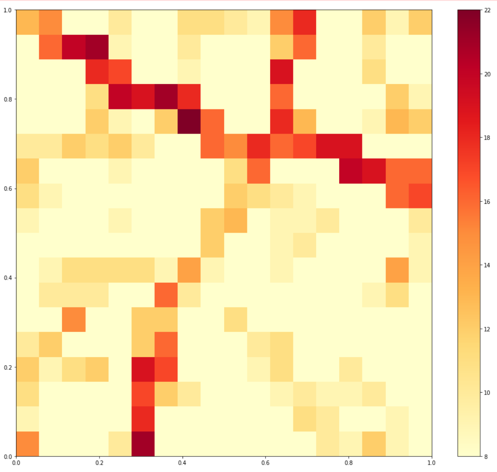
</p> 

The colors of the pixels could mapped into numbers. To make an analogy with the previous examples, these numbers can be thought as the solutions given by the *DMK solver* related to the optimal values of a transportation problem. With this in mind, a graph can be pre-extracted. 

```
image_path="./PVM_data/IMG_0379_motion_16_251x2.jpg"
graph_type='1'
t1=.09
t2=.1
number_of_colors=100
number_of_cc=1
new_size=18
G_pre_extracted,_ = pre_extraction_from_image(image_path,
                                            new_size,
                                            graph_type,
                                            t1,
                                            t2,
                                            number_of_colors,
                                            number_of_cc)
```

<p align="center">
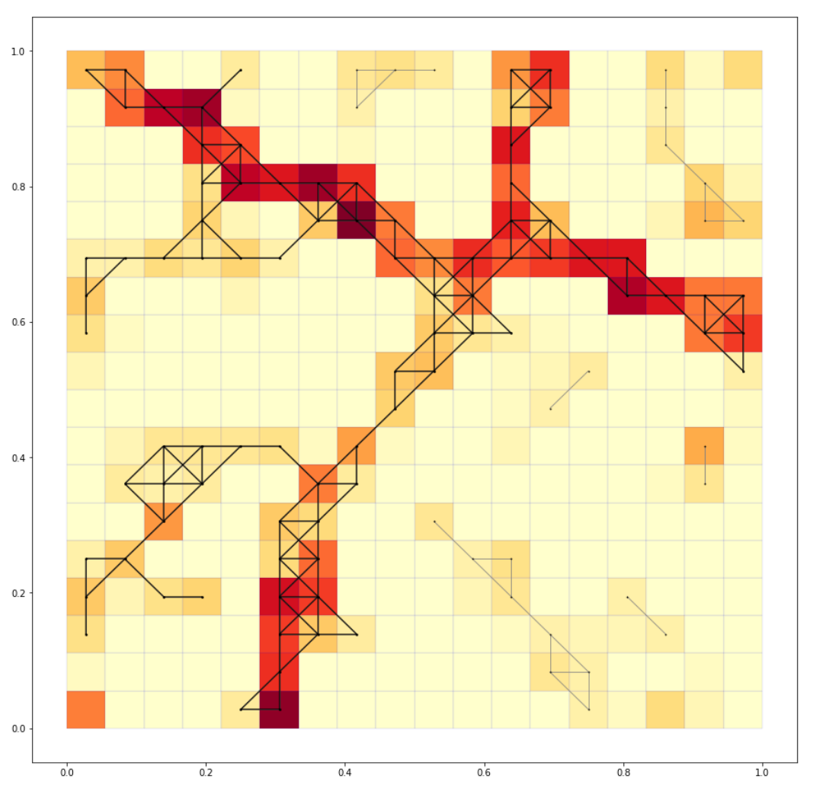
</p> 


The thicker edges correspond to the main connected component of the extracted graph $G$. Assume that that connected component is the pre-extracted graph we are interested in (so it would be our $G$ from now on). 

Let's focus now on the part of the image that it is interesting for us and try to filter the graph $G$ representing that part. For this, let's map the image into a binary version of it and show the freshly pre-extracted graph. 

<p align="center">
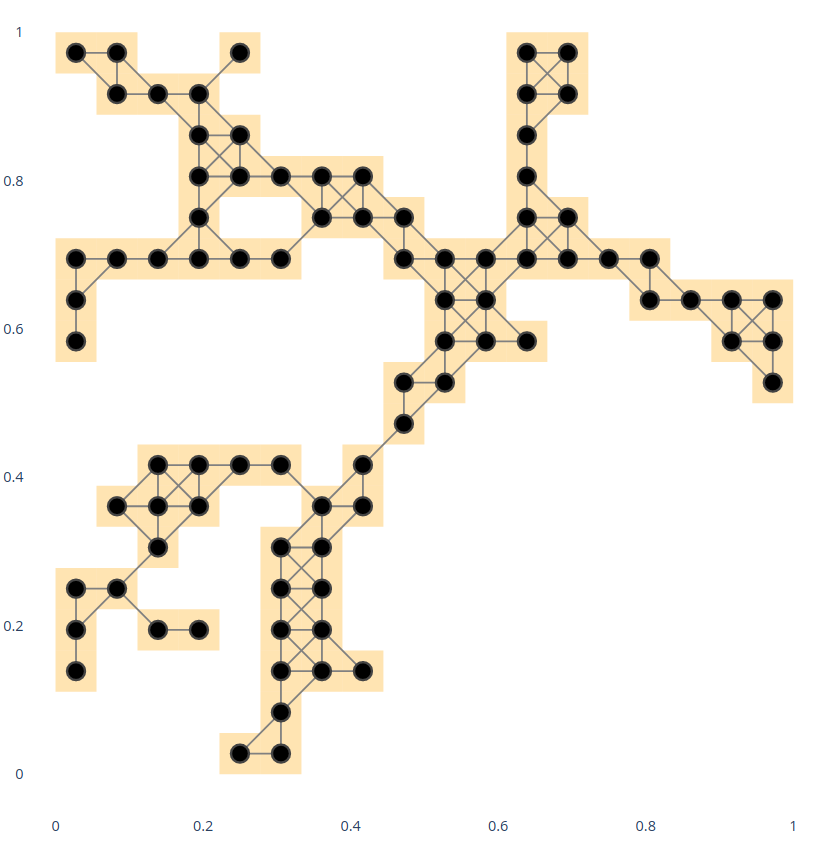
</p> 

___

#### PMV 8: Tree approximation

In some cases, it might be useful to do an intermediate step between the pre-extraction and the filtering. Instead of filtering directly on $G$, we could approximation $G$ by another graph and the apply the filtering. This is useful if we would like the filtering dynamics to focus on a particular structure contained on $G$. 

To do this, the next lines should be executed:

```
from pre_extraction import tree_approximation

bfs_Graph = tree_approximation(G_pre_extracted)
```

The output looks like this:

<p align="center">
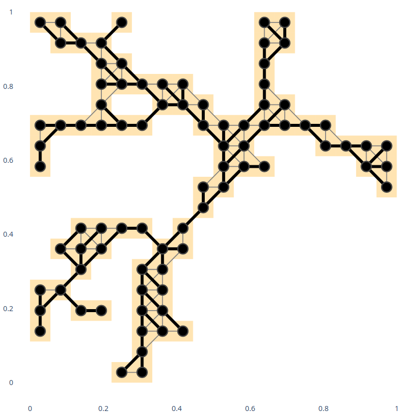
</p> 


and it is a Breadth-first-search approximation of $G$. 

___

#### PMV 9: Looking for the terminals

Once this graph is obtained, the next step, as we know, is to filter it. In order to call the function *fitlering()* we need to get candidates for the source and sinks (since the new dynamics need them to define the new transportation problem). An automatic way of doing this can be used by calling the function *terminal_finder()*. It divides the spaces in different subregions and classifies the parts of the grah inside these subregions into three different categories: red, blue and green. The way these categories are defined is written in the *paper*. For some colored parts, terminals are chosen. We call this color scale the *terminal map*. 

```

from terminal_computation import terminal_finder

partition_dict, _, _ = partition_set(new_size + 1)

nbr_graph, color_nbr, terminal_list, nodes_for_correction, filter_number = terminal_finder(D,
                partition_dict,
                G_pre_extracted)

```

<p align="center">
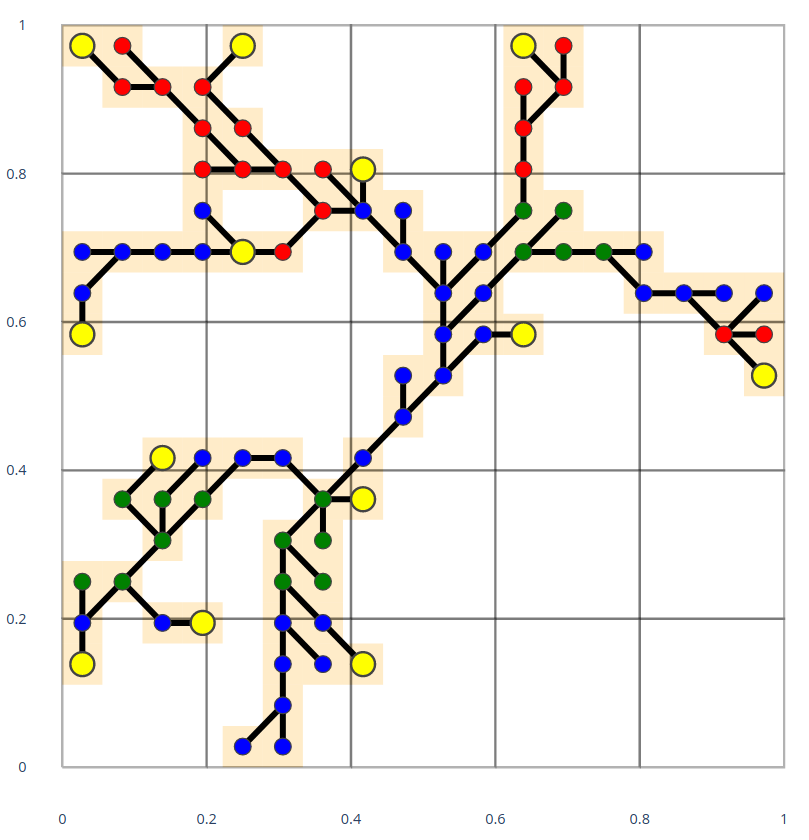
</p> 

The yellow nodes correspond to the set of *terminals* from which the source and sink nodes will be taken. 

___

#### PMV 10: Filtering

Now we have all the ingredients to filter $G$: namely $G$ and the terminals. The first element of the terminal list (*entry*=0) will serve as source and the remaining ones as sinks. 

```
folder_name='./runs/1_b14_6dv_sf14_rect_cnstrect_cnst/'
graph_type='1'
weighting_method_simplification="ER"
weight_flag="length"
min_=.01
BP_weights="BPtdens"
entry=0
terminal_info = [terminal_list,entry]
input_flag='image'
beta_d=1.

G_filtered,_,_,_,_,_ = filtering(
                bfs_Graph,
              folder_name,
              beta_d,
              graph_type,
              weighting_method_simplification,
              weight_flag,
              min_,
              BP_weights,
              terminal_info,
                input_flag)
``` 

The output graph is:

<p align="center">
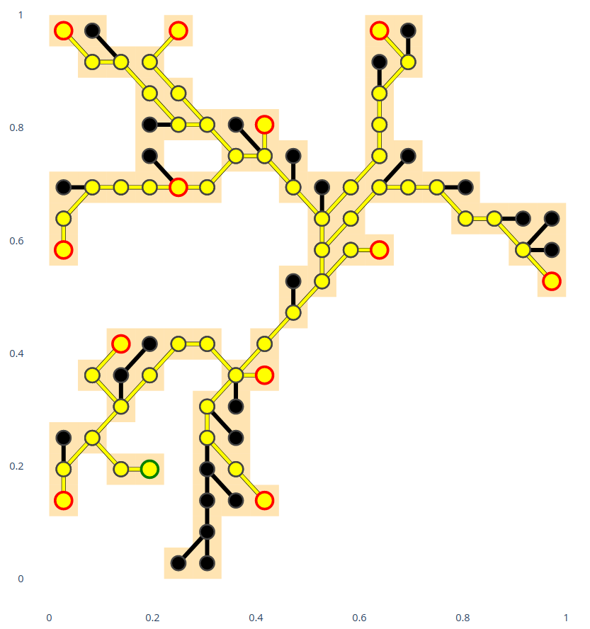
</p> 

The green line corresponds to the source node and the red one to the sink nodes, the black parts are the ones on the approximation of $G$, and finally, the yellow edges and nodes are the ones of the filtered graph. 

___